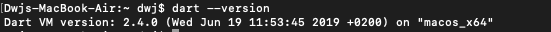
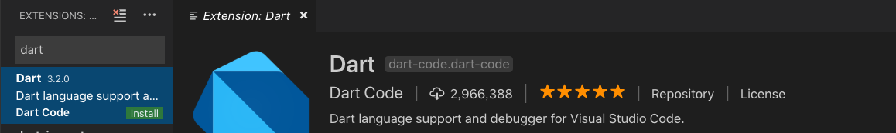
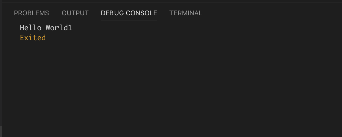

# 进击的Dart 01 — 配置环境

[TOC]


## 下载Dart SDK

> Dart SDK可以用命令行安装或者通过URL直接下载Zip文件。由于不同平台命令行安装方式不一致,这里我们选择直接下载后解压

我们使用 **2.4, Stable** 版本(Stable是稳定版本,Dev是开发版本)

* Mac(64位)

  ```
  https://storage.googleapis.com/dart-archive/channels/stable/release/2.4.0/sdk/dartsdk-macos-x64-release.zip
  ```

* Windows(64位)

  ```
  https://storage.googleapis.com/dart-archive/channels/stable/release/2.4.0/sdk/dartsdk-windows-x64-release.zip
  ```

  


## 配置Dart环境

* Mac

  1. 终端切换到根目录 `cd ~`

  2. 打开bash_profile文件 `open -e .bash_profile ` (如果没有该文件则创建 `touch .bash_profile`)

  3. 增加dart/bin的环境配置(PATH后面使用的自己的dart-sdk/bin的路径)

     ```
     # config Dart Env
     export PATH=/Volumes/Extend/codesoft/dart/dart-sdk/bin:$PATH
     ```

  4. 保存bash_profile并生效环境配置 `source .bash_profile`
  5. 终端验证Dart环境是否配置成功 `dart --version`



* Windows

  1. 我的电脑->控制面板->系统和安全->系统->高级系统设置->高级->环境变量

  2. 新增Path, 增加dart-sdk/bin的地址

     

  3. 终端验证Dart环境是否配置成功 `dart --version

     

## 开发Tools

> 支持Dart的tools有
>
> * DartPad — 官方推荐,网页版本,无需本地环境
> * Android studio
> * VS Code
> * IntelliJ IDEA 
> * Vim
> * Atom


**这里我们选择VS Code,原因不多说,因为强大! **

1. 安装Dart插件 — Extensions -> dart



2. 重启VS Code


## HelloWorld(后续所有项目默认基于VS Code开发)

> 惯例,用新的语言向全世界问好！

1. 新建文件夹 `HellowWorldDemo/bin`

2. 新建文件 `HelloWorld.dart`

3. 向大家问好！

   ```
   // HelloWorld.dart
   
   void main() {
     print("Hello World");
   }   
   ```

4. 配置`launch.json`(Debug中的设置图标)

   ```
   {
       "version": "0.2.0",
       "configurations": [
           
           {
               "name": "Dart",
               "program": "bin/HelloWorld.dart",
               "request": "launch",
               "type": "dart"
           }
       ]
   }
   ```

5. 运行 `F5(Windows)/fn+F5(Mac)`

6. 收工！

   

